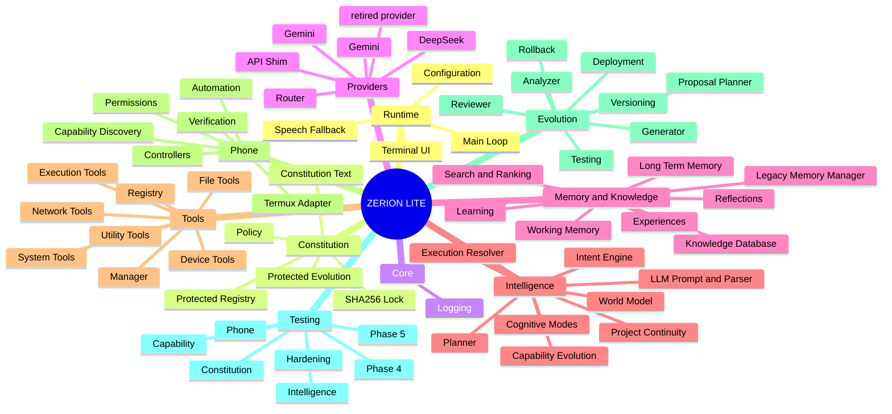

# Zerion Lite Architecture Mind Map



## Human-readable architecture tree

```text
ZERION LITE
├── Runtime
│   ├── main.py
│   ├── terminal.py
│   ├── speech.py
│   └── config.py
├── Constitution
│   ├── constitution.txt
│   ├── constitution.lock
│   ├── Constitution Engine
│   ├── Policy
│   └── Protected Evolution
├── Core
│   └── Logging
├── Providers
│   ├── API compatibility shim
│   ├── Router
│   ├── Gemini
│   ├── Gemini
│   ├── retired provider
│   └── DeepSeek
├── Memory and Knowledge
│   ├── Legacy Memory Manager
│   ├── Working / Long-Term Memory
│   ├── Knowledge Database
│   ├── Search / Ranking / Indexing
│   ├── Learning
│   ├── Experiences
│   └── Reflections
├── Intelligence
│   ├── LLM
│   ├── Intent
│   ├── Planner
│   ├── Cognitive Engine
│   ├── Capabilities
│   ├── Execution Resolver
│   ├── World Model
│   └── Projects
├── Tools
│   ├── Tool Registry and Manager
│   ├── File
│   ├── System
│   ├── Network
│   ├── Device
│   ├── Execution
│   └── Utility
├── Phone
│   ├── Termux Adapter
│   ├── Discovery
│   ├── Controllers
│   ├── Permission Manager
│   ├── Automation
│   └── Verifier
├── Evolution
│   ├── Analyzer
│   ├── Upgrade Planner
│   ├── Reviewer
│   ├── Generator
│   ├── Test Runner
│   ├── Deployment
│   ├── Versioning
│   └── Rollback
└── Tests
    ├── Hardening
    ├── Constitution
    ├── Intelligence
    ├── Capabilities
    ├── Phone
    ├── Phase 4
    └── Phase 5
```
